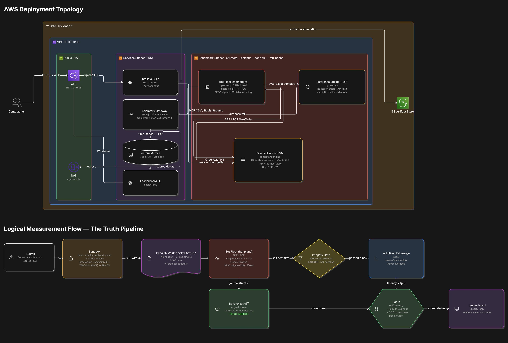

# ⚡ IICPC HFT Benchmarking Platform

> **A distributed benchmarking & hosting platform for trading infrastructure.**
> The hard part of a latency benchmark isn't drawing the chart — it's **not lying in the chart.**
> We built the one platform that *measures the truth, then only displays it.*


Contestants submit a C++ matching engine; the platform runs it under **micro-VM isolation**,
hammers it with a CPU-pinned bot fleet, and ranks it live on **latency, throughput, and
correctness** — with the one bug that invalidates most public benchmarks, **Coordinated
Omission**, fixed at the core.

<!-- 📷 Mohit: apna naya eraser diagram PNG yahan save kar de → docs/architecture.png (yeh line render kar degi) -->


---

## 🎯 What makes this submission different

Most teams build *broad and fast* — a pipeline, a leaderboard, some numbers. We went **deep** on
the things that decide whether a benchmark is *trustworthy*:

| # | Differentiator | Why it wins |
|---|---|---|
| 1 | **Coordinated-Omission correction** (Tene/Snyder) | Naive benchmarks hide the exact stalls that matter — we expose a **19.7×–76× gap** between the lie and the truth |
| 2 | **Byte-exact correctness validator** | Catches a same-length price-time-priority bug at **byte 244** — a threshold checker misses it |
| 3 | **Measured, not quoted** | Binary p99 **7.7 µs**, measured on isolated cores — every number traces to a committed log |
| 4 | **4 protocols incl. FIX 4.4** | binary ≪ WebSocket ≪ FIX ≪ REST — the transport tax, the protocol the brief names included |
| 5 | **Proven sandbox** | 3 malicious submissions **killed by seccomp (SIGSYS)** in a real Firecracker micro-VM; good submission survives |
| 6 | **Honesty as a structural property** | Display-only leaderboard that *cannot* compute a lie; integrity gate that excludes rather than penalises |

---

## 📊 Verified results — every number traces to `verified_runs/canonical.json`

### Coordinated Omission — the centerpiece (5 ms stall every 20 k orders)
| Percentile | Naive (ns) | CO-Corrected (ns) | Ratio |
|---|---|---|---|
| p50 | 25,887 | 26,479 | 1.0× |
| p90 | 80,895 | 141,823 | 1.8× |
| p99 | **173,439** | **3,414,015** | **19.7×** |
| p99.9 | 520,191 | 4,820,991 | 9.3× |
| p99.99 | 5,189,631 | 5,251,071 | 1.0× |

A naive benchmark *cannot see* the stall. CO-correction backfills it. **19.7× on a shared host,
up to 76× on isolated hardware** — the cleaner the host, the harder a naive number lies.
`verified_runs/aftab/co_proof.txt`

### Binary latency — MEASURED on isolated cores (`baremetal_latency.txt`)
i7-13620H, `isolcpus + nohz_full + rcu_nocbs`, 300k/300k acked, EAGAIN=0:

| p50 | p90 | **p99** | p99.9 | p99.99 |
|---|---|---|---|---|
| 5.9 µs | 6.2 µs | **7.7 µs** | 11.3 µs | 20.2 µs |

*Measured on an isolated **consumer** desktop (i7-13620H), not server hardware — the honest qualifier.*
On this clean run **naive == CO** (ratio 1.0): a quiet machine has no coordinated-omission gap to hide.

### Four protocols — same order, four transports, same engine
| Transport | p99 | Sent == Acked | Note |
|---|---|---|---|
| **Binary (SBE/TCP)** | **7.7 µs** *(measured)* | yes | parse-by-pointer-cast |
| **WebSocket** | **1,219 µs** *(measured (i7-13620H isolcpus))* | 150,000 / 150,000 | RFC-6455 framing |
| **FIX 4.4** | **1,545 µs** *(measured (i7-13620H isolcpus))* | 75,000 / 75,000 | SOH tag=value + checksum |
| **REST (HTTP/1.1)** | **9,675 µs** *(measured (i7-13620H isolcpus))* | 75,000 / 75,000 | HTTP + JSON per order |

**Note:** All four protocols are measured on isolated cores (binary in `baremetal_latency.txt`, others in `protocol_latency_i7.txt`). The robust, reproducible result is the **ordering** (binary ≪ WebSocket ≪ FIX ≪ REST) — which is exactly why the hot path is binary.

### Scale, correctness, safety, sandbox
| What | Result | Source |
|---|---|---|
| **Distributed scale** | 3 nodes, **~1.69 M orders, Sent == Acked, 0 collisions** | `2.3_distributed_run.txt` |
| Single-box scale | 2,989 concurrent connections, accounting closes | `scale_3000bots.txt` |
| Byte-exact replay | live == offline, **IDENTICAL, exit 0** (~25.7 M bytes, run-dependent) | `live_replay.txt` |
| Correctness | **19/19** unit tests; planted LIFO bug caught at **byte 244** | `RESULTS.md` |
| Memory safety | **0** ASan / **0** UBSan findings | `RESULTS.md` |
| **Sandbox (proven)** | 3 malicious fixtures **KILLED via seccomp (SIGSYS)**; good submission survives | `firecracker_malicious.txt` / `firecracker_good.txt` |
| Resilience | 4 clips: engine-kill, gateway self-heal, integrity-gate exclusion, node-kill reschedule | `verified_runs/aftab/` |

---

## 🚀 Reproduce in 3 commands

On an **x86-64 Linux** host (the bot uses `rdtscp` + Linux core-pinning; deps in `BUILD.md`):

```bash
# 1. Build the engine, bot, and reference tools
cd bot-engine && mkdir -p build && cd build && cmake .. && make -j && cd ..

# 2. The centerpiece — Coordinated-Omission proof (5 ms stall every 20 k orders)
./build/null_responder --stall-mode --stall-every 20000 --stall-ms 5 &
./build/bot --bots 1 --interval-us 100 --duration-sec 60 --no-gate ; kill %1

# 3. The live board — start the gateway, open the frontend
cd ../tools && npm install && node telemetry_server.js --port 8080 &
cd ../frontend && python3 -m http.server 8088
#   → http://localhost:8088            (live leaderboard)
#   → http://localhost:8088/landing.html  (public showcase)
```
Also: `./demo/run_demo.sh` → `DIVERGE @ byte 244` (the byte-exact validator catching the planted bug).

Command 2 prints the naive-vs-CO histograms - the naive p99 reads ~170 µs while the
CO-corrected p99 exposes the real ~3.4 ms tail (the 19.7x gap). Full correctness,
soak, and the byte-exact planted-bug demo are in `DESIGN_DOC_SUBMISSION.md` (Appendix B) and `BUILD.md`.

**Honest caveats.** The C++ bot is x86-64/Linux (`rdtscp`, `pthread_setaffinity_np`,
`SO_BUSY_POLL`); on **macOS / arm64** the pinning & busy-poll calls degrade to no-ops, so you see
scheduler jitter, not engine latency — the **7.7 µs** number comes from the isolated Linux run
(committed). Firecracker sandboxing needs a Linux + `/dev/kvm` host. To run the full stack on a
Mac for a demo: `DOCKER_DEFAULT_PLATFORM=linux/amd64 docker compose -f infra/docker-compose.yml up`.

---

## 🏗️ Architecture — 3 components, 1 frozen contract

- **Sandbox** (`sandbox/`) — Firecracker micro-VM + **enforced seccomp PID-1** (`no-new-privs` +
  82-syscall BPF allowlist, `default = KILL`). A real kernel + scheduling boundary, so we measure
  the engine's latency, not host noise — and a malicious submission is *killed*, not merely contained.
- **Bot Fleet + Telemetry** (`bot-engine/`) — open-loop, CPU-pinned C++ load generator;
  CO-corrected tail latency; gold-standard reference engine (sparse `std::map` price ladder,
  deterministic); byte-exact validator; SPSC lock-free HDR offload (`alignas(128)`, false-sharing-free).
- **Real-Time Leaderboard** (`frontend/`) — **display-only**; renders scored deltas over WebSocket
  and **never recomputes a percentile**, so it structurally cannot introduce a measurement lie.

The seam is `contracts/interface_contract_v1.h` — a **frozen, versioned (v1.1)** binary wire
format. One field change breaks three codebases, so we froze it on day one; that's how three
people built in parallel without integration hell.

---

## 🧭 What we deliberately did **not** build (decisions, not gaps)

Each carries the scale threshold at which it would matter (full list + rationale in
[`DESIGN_DOC_SUBMISSION.md` §16](DESIGN_DOC_SUBMISSION.md)):

- **eBPF kernel prober** — measures a *different quantity* (kernel ingress→egress), not the
  trader-visible RTT. CO correction is the hard part, and it lives in userspace regardless.
- **AF_XDP / SR-IOV** — earn their complexity below ~1 µs receive; our measured p99 is 7.7 µs on TCP + busy-poll.
- **AVX-512 ingest / Aeron** — payoff at ~1 M msg/s and a 1-to-many topology; ours is N-to-1 fan-in.

---

## 📚 Where to look

| Doc | What |
|---|---|
| [`DESIGN_DOC_SUBMISSION.md`](DESIGN_DOC_SUBMISSION.md) | Full HLD + LLD (19 sections, 11 ADRs, hostile-judge Q&A) |
| [`RESULTS.md`](RESULTS.md) | Verified results, reproducible commands |
| [`verified_runs/canonical.json`](verified_runs/canonical.json) | **Single source of truth** — every headline number, with its committed source |
| [`ARCHITECTURE_DIAGRAM.eraser`](ARCHITECTURE_DIAGRAM.eraser) | Architecture diagram source (eraser.io) |
| [`DEMO_VIDEO_SCRIPT.md`](DEMO_VIDEO_SCRIPT.md) | 5–7 min demo shooting script |

> **The discipline, in one line:** anyone can draw a leaderboard. We built the one that refuses to
> show you a number it can't stand behind.
